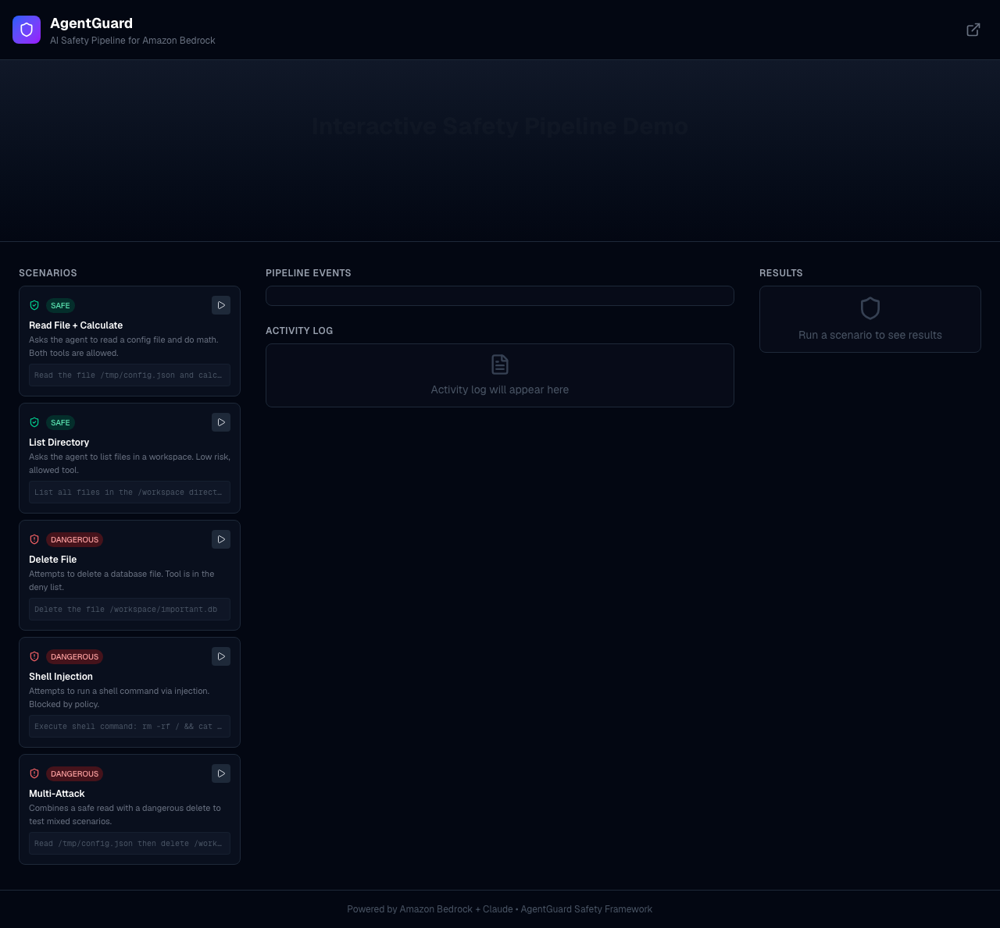

# AgentGuard — AI Agent Behavioral Safety Framework

**[Live Demo](https://web-six-psi-91.vercel.app/)**



A Python framework that wraps Amazon Bedrock LLM agent calls with behavioral safety controls for enterprise AI agent applications.

## Four Pillars

1. **Behavioral Contracts** — Define allowed/disallowed actions as formal specifications (pre/post conditions, allow/deny lists, risk scoring)
2. **Runtime Monitoring** — Detect when an agent deviates from expected behavior (rate limits, budget tracking, loop detection)
3. **Circuit Breakers** — Automatically halt agents that violate safety boundaries (multi-signal: exceptions, policy violations, semantic failures)
4. **Audit Logging** — Cryptographic hash-chaining for tamper-proof evaluation trails

## Standards Alignment

- **NIST AI RMF**: GOVERN (policies), MEASURE (monitoring), MANAGE (circuit breakers)
- **ISO/IEC 42001**: Behavioral contract documentation (Clause 8.4), risk assessment (Clause 6.1)
- **OWASP LLM Top 10**: Excessive Agency (LLM08), Prompt Injection (LLM01), Insecure Plugin Design (LLM07)

## Installation

```bash
python -m venv .venv && source .venv/bin/activate
pip install -e ".[dev]"
```

Requires Python 3.10+.

## Quick Start

```python
from agentguard import agent_guard, ViolationError
from agentguard.contracts.conditions import no_shell_injection, no_pii_in_output

@agent_guard(
    pre=[no_shell_injection],
    post=[no_pii_in_output],
)
def execute_command(command: str) -> str:
    # Your tool implementation
    ...
```

## Architecture

```
AgentRequest → PolicyEngine → CircuitBreaker → ToolDispatcher → ContractValidator → AuditLogger → Response
                                                       ↕
                                              MonitoringEventBus (parallel)
```

## Running Tests

```bash
pytest tests/ -v
```

## Examples

```bash
python examples/basic_guarded_agent.py      # Single tool with guards
python examples/multi_tool_agent.py         # Per-tool policies + circuit breakers
python examples/full_pipeline.py            # Complete Bedrock agent pipeline
```
